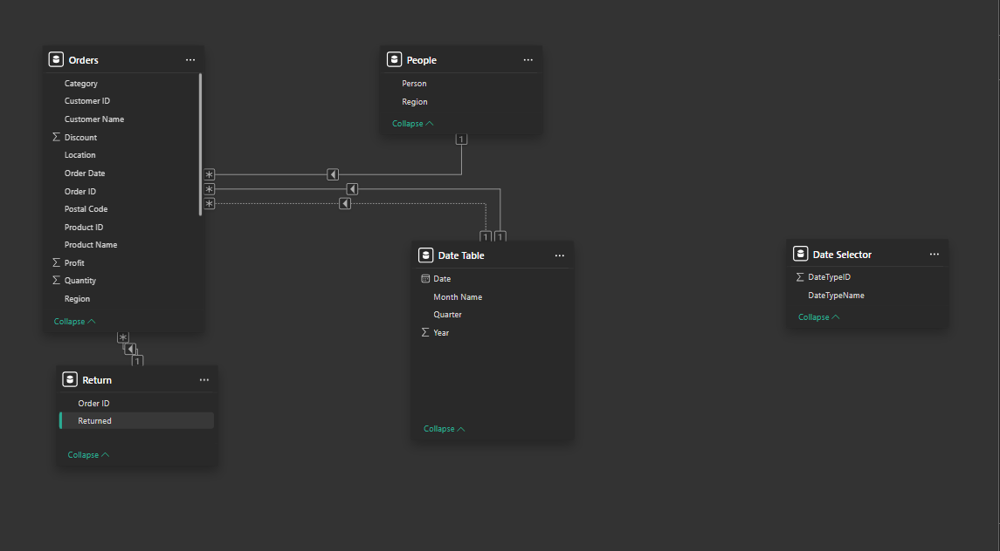
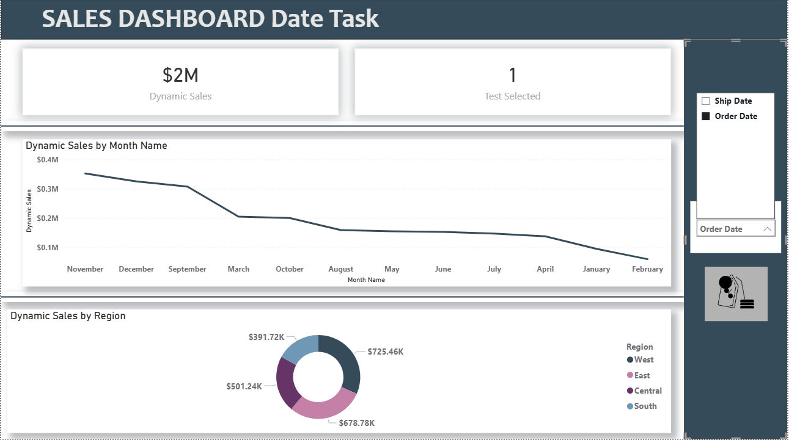

# 📊 Sales — Date Intelligence Task
### Power BI Project | Superstore Dataset

---

## 🗂️ Dataset
Three tables loaded from the Superstore dataset:
- **Orders** — main fact table 
- **People** — sales representatives by region
- **Return** — returned orders

---

## 🔧 ETL — Power Query

### Problem
The `ship date` column had malformed date values in the format:
```
1101102016  →  should be  11/11/2016
```

### Solution (Step by Step)
1. **Split by position** → extracted the **Year** (last 4 digits)
2. **Split by position (1 char)** → extracted and removed the leading zero
3. **Split** → extracted the **Day**
4. **Split** → extracted the **Month**
5. **Merge Columns** → combined Day, Month, Year back together
6. **Change Type** → converted the merged column to `Date` ✅

---

## 🗓️ Data Model

### Date Table (DAX)
```dax
Date Table = 
ADDCOLUMNS(
    CALENDAR(
        MIN(MIN(Orders[Order Date]), MIN(Orders[ship date])),
        MAX(MAX(Orders[Order Date]), MAX(Orders[ship date]))
    ),
    "Year", YEAR([Date]),
    "Month Name", FORMAT([Date], "MMMM"),
    "Quarter", "Q" & QUARTER([Date])
)
```

### Relationships
| From | To | Type | Status |
|------|----|------|--------|
| `Date Table[Date]` | `Orders[Order Date]` | Many-to-One | ✅ Active |
| `Date Table[Date]` | `Orders[ship date]` | Many-to-One | ⚪ Inactive |

### Data Model Screenshot


---

## 🧮 DAX Measures

### Date Selector Table (Disconnected)
```
DateTypeID | DateTypeName
-----------|-------------
1          | Order Date
2          | Ship Date
```
> This table is **not connected** to any other table — used only to drive the slicer.

### Measures
```dax
Dynamic Sales = 
VAR SelectedType = SELECTEDVALUE('Date Selector'[DateTypeID], 1)
RETURN
SWITCH(
    SelectedType,
    1, CALCULATE(SUM(Orders[Sales])),
    2, CALCULATE(
           SUM(Orders[Sales]),
           USERELATIONSHIP('Date Table'[Date], Orders[ship date])
       )
)
```

---

## 📊 Dashboard — Sales Dashboard Date Task

### Dashboard Screenshot


### Visuals
- **KPI Card** — Total Dynamic Sales (`$2M`)
- **Line Chart** — Dynamic Sales by Month Name
- **Donut Chart** — Dynamic Sales by Region (West / East / Central / South)
- **Dropdown Slicer** — "Select Date Type" → Order Date / Ship Date

### How It Works
When the user selects **Order Date** or **Ship Date** from the slicer:
- All visuals update simultaneously
- Monthly trend changes based on the selected date dimension
- Regional breakdown recalculates accordingly

---

## 💡 Key Learnings
- `USERELATIONSHIP` only works with **Inactive** relationships — you must have both an active and inactive relationship to the Date Table
- A **Disconnected Table** (no relationships) is the correct pattern for driving dynamic measure switching via a slicer
- `SELECTEDVALUE` inside `SWITCH` reads the slicer selection and routes to the correct measure
- Power Query's **Split by Position** is powerful for fixing non-standard date formats

---

## 🛠️ Tools Used
- **Power BI Desktop**
- **Power Query** (ETL)
- **DAX** (Data Modeling & Measures)
- Dataset: Superstore (Orders, People, Return)
